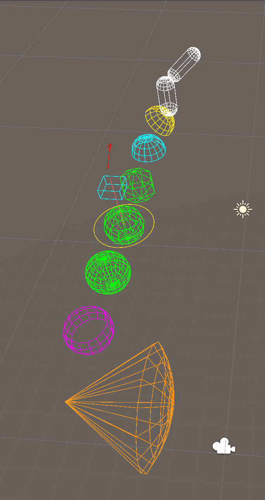

# Teekay Unity Utils

[](https://unity.com/releases/editor/whats-new/6000.3)
[](https://github.com/teekay-bot/Teekay-Unity-Utils/tags)
[](com.teekay.unity-utils/LICENSE.md)

Curated Unity utilities: extension methods, singletons, an event bus, debug drawing, and an in-game
developer console. Small, tested, zero prefabs — everything is plain code.

**Requires Unity 6000.3 (Unity 6.3 LTS) or newer.**

<table>
<tr>
<td align="center" width="50%">
  <br>
  <sub><b>DevConsole</b> — commands, CVars, filtering, duplicate collapsing</sub>
</td>
<td align="center" width="50%">
  <br>
  <sub><b>DebugDraw</b> — capsules, domes, perception cones, in Scene view <i>and</i> builds</sub>
</td>
</tr>
</table>

## Installation

**Package Manager UI** — `Window ▸ Package Manager ▸ + ▸ Install package from git URL…` and paste:

```
https://github.com/teekay-bot/Teekay-Unity-Utils.git?path=/com.teekay.unity-utils#v3.0.0
```

**Or edit `Packages/manifest.json`** directly:

```json
"com.teekay.unity-utils": "https://github.com/teekay-bot/Teekay-Unity-Utils.git?path=/com.teekay.unity-utils#v3.0.0"
```

The two forms are **not** interchangeable — the Package Manager's git URL field takes the bare URL only,
so pasting the `manifest.json` line into it fails.

Drop the `#v3.0.0` suffix to track the latest commit instead of a release. The `.git` extension and
`?path=` are both required: without `.git` the Package Manager treats the URL as a package name.

## Documentation

| Module | |
|---|---|
| [Extensions](com.teekay.unity-utils/Documentation~/Extensions.md) | 84 methods over vectors, transforms, GameObjects, colours, collections, strings and more. |
| [Physics](com.teekay.unity-utils/Documentation~/Physics.md) | Cached `GetComponentInParent` lookups for physics-scan hot paths. |
| [Singleton](com.teekay.unity-utils/Documentation~/Singleton.md) | Scene-local and persistent singleton base classes. |
| [EventBus](com.teekay.unity-utils/Documentation~/EventBus.md) | Type-keyed pub/sub with zero-alloc publish. |
| [DebugDraw](com.teekay.unity-utils/Documentation~/DebugDraw.md) | One drawing API, rendering in the Scene view **and** in builds under any pipeline. |
| [DevConsole](com.teekay.unity-utils/Documentation~/DevConsole.md) | In-game console: commands, CVars, autocomplete, bindings, log capture. |
| [Attributes](com.teekay.unity-utils/Documentation~/Attributes.md) | `[KeyPicker]` click-to-listen key capture, `[SubclassSelector]` type dropdown for `[SerializeReference]` fields. |

Start with the [package README](com.teekay.unity-utils/README.md) for a quick tour of every module.

## Repository layout

- [`com.teekay.unity-utils/`](com.teekay.unity-utils/) — the UPM package
  ([README](com.teekay.unity-utils/README.md) · [CHANGELOG](com.teekay.unity-utils/CHANGELOG.md) ·
  [LICENSE](com.teekay.unity-utils/LICENSE.md)).
- [`DevProject/`](DevProject/) — Unity 6000.3 host project for development: tests (Test Runner) and
  per-feature demo scenes. Open `DemoHub` and press Play. Not shipped to consumers — the `?path=` install
  URL scopes them to the package folder only.

## License

[MIT](com.teekay.unity-utils/LICENSE.md) — portions adapted from
[adammyhre/Unity-Utils](https://github.com/adammyhre/Unity-Utils).
