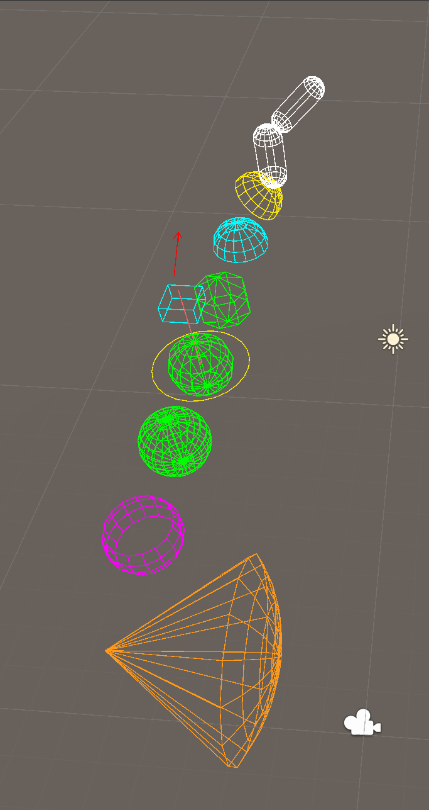

# DebugDraw

One drawing API, two backends. Call sites describe *what* to draw; the drawer decides *how*.



*Every shape in the demo scene: a capsule, two domes, a coarse and a fine sphere, a circle, an
equatorial band, and a view cone whose far end is a spherical cap.*

| Backend | Where it renders | Hook |
|---|---|---|
| `GizmosDebugDrawer` | Scene view (editor only) | `OnDrawGizmos` / `OnDrawGizmosSelected` |
| `GLDebugDrawer` | Game view **and builds**, every render pipeline | `GLDebugDrawRenderer` on a camera |

Both drive the same tessellation code, so a shape looks identical in both views. If the Scene view and
the Game view disagree, that is a bug — not a backend difference.

```csharp
using TeekayUtils;

readonly GizmosDebugDrawer gizmos = new();

void OnDrawGizmos()
{
    gizmos.WireSphere(transform.position, hearingRange, Color.cyan);
    gizmos.ViewCone(eye.position, eye.forward, viewAngle, viewRange, Color.yellow);
    gizmos.WireCapsule(feet.position, head.position, bodyRadius, Color.green);
}
```

---

## Shapes

`IDebugDrawer` — every method takes an explicit `Color`; nothing reads global state.

| Method | Notes |
|---|---|
| `WireSphere(center, radius, color)` | Latitude/longitude grid at default density (6 rings × 16 slices). |
| `WireSphere(center, radius, color, rings, slices)` | Explicit density. `rings` clamps to ≥ 1, `slices` to ≥ 3. |
| `WireSphereBand(center, up, radius, color, fromPolarDegrees, toPolarDegrees, rings, slices)` | Partial band — domes, asymmetric volumes. |
| `Sphere(center, radius, color)` | Solid in Gizmos; a small 3D cross in GL (see below). |
| `WireCapsule(start, end, radius, color)` | End points are **sphere centres**, matching `Physics.CheckCapsule`. |
| `WireCapsule(start, end, radius, color, rings, slices)` | Explicit cap density. |
| `ViewCone(apex, direction, fullAngleDegrees, range, color)` | Perception volume. Angle is the **full** cone angle. |
| `ViewCone(apex, direction, fullAngleDegrees, range, color, rings, slices)` | Explicit density. |
| `Line(from, to, color)` | |
| `Ray(from, direction, color)` | `direction` is a **delta**, not normalized — the line ends at `from + direction`. |
| `Arrow(from, direction, color)` | `Ray` with a head; the head scales with length. |
| `Circle(center, normal, radius, color)` | An **outline**, not a filled disc. |
| `WireCube(center, size, color)` | `size` is full extents, like `Gizmos.DrawWireCube`. |

### Conventions that are easy to get wrong

**Polar angles** (`WireSphereBand`) are measured from `up`: `0` = the pole along `up`, `90` = the
equator, `180` = the opposite pole. So `(0, 180)` is a full sphere and `(0, 90)` is an upper dome.

**Cone angle** (`ViewCone`) is the **full** angle, matching how a view angle is normally configured and
then tested:

```csharp
if (Vector3.Angle(transform.forward, toTarget) <= viewAngle * 0.5f) { /* visible */ }
drawer.ViewCone(eye.position, transform.forward, viewAngle, viewRange, Color.yellow);
```

**Capsule end points** are the centres of the two cap spheres, **not** `CapsuleCollider.height`. For a
collider, the centres sit `height / 2 - radius` either side of its centre:

```csharp
float half = capsule.height * 0.5f - capsule.radius;
Vector3 axis = transform.up * half;
drawer.WireCapsule(capsule.transform.position - axis,
                   capsule.transform.position + axis, capsule.radius, Color.green);
```

**`ViewCone`'s far end is a spherical cap, not a flat disc** — because that is the shape a distance check
actually produces. A flat disc would overstate the range everywhere except dead centre.

### Degenerate input

Silently draws nothing rather than emitting garbage: `radius <= 0` (sphere, capsule), `range <= 0` or a
near-zero `direction` (cone), zero-length `direction` (arrow head). A zero-length capsule collapses to a
single sphere. Pole rings are skipped instead of drawn as zero-length segments.

---

## Rendering in the Game view and in builds

Gizmos only exist in the editor. For anything that must survive a build, use `GLDebugDrawRenderer`:

```csharp
using TeekayUtils;

[RequireComponent(typeof(GLDebugDrawRenderer))]
public class PerceptionDebug : MonoBehaviour   // put this on the camera
{
    GLDebugDrawRenderer glRenderer;

    void Awake()     => glRenderer = GetComponent<GLDebugDrawRenderer>();
    void OnEnable()  => glRenderer.Drawing += Draw;
    void OnDisable() => glRenderer.Drawing -= Draw;

    void Draw(IDebugDrawer drawer)
    {
        foreach (var agent in Agents)
            drawer.ViewCone(agent.Eye, agent.Forward, 70f, 12f, Color.yellow);
    }
}
```

`GLDebugDrawRenderer` owns the line material and opens the GL block for you — **do not** call
`GL.Begin`/`GL.End` inside the `Drawing` handler.

### Why the component exists

`OnPostRender` is only called by the **Built-in** render pipeline. Under URP or HDRP it never fires, so a
hand-wired GL drawer draws nothing at all — no error, no warning, nothing in the console to suggest it
was wired up. `GLDebugDrawRenderer` subscribes to both `OnPostRender` and
`RenderPipelineManager.endCameraRendering`, and only the one matching the active pipeline fires.

`RenderPipelineManager` lives in `UnityEngine.CoreModule`, so this costs the package **no dependency** on
URP or HDRP.

### `Sphere` is not a wire sphere in GL

`GL.LINES` cannot fill, so `GLDebugDrawer.Sphere` draws a small axis-aligned 3D cross instead. For the
usual "marker dot" case (`radius < 0.1f`) that reads better than a tiny wire ball. Use `WireSphere` when
you want the volume.

---

## Built-in overlays: `IDebugDrawable` + `DebugDrawHub`

The two backends above are the low level. When a *system* should be able to show its own workings —
a motor explaining why it thinks it is airborne, a targeting pipeline showing what it scored — do not
write another visualiser component. Implement `IDebugDrawable` on the class that owns the facts and
register it:

```csharp
public sealed partial class Motor : MonoBehaviour, IDebugDrawable
{
    [SerializeField] bool _drawGrounding = true;

    public bool DebugEnabled => _drawGrounding;

    void OnEnable()
    {
        DebugDrawHub.Register(this);
        DebugDrawHub.RegisterToggle("motor.grounding", "Ground normal + slope verdict.",
            () => _drawGrounding, v => _drawGrounding = v);
    }

    void OnDisable() => DebugDrawHub.Unregister(this);

    public void DrawDebug(IDebugDrawer drawer, IDebugLabelSink labels)
    {
        drawer.Arrow(_groundPoint, _groundNormal * 0.4f, _stable ? Color.green : Color.red);
        labels.Label(_groundPoint, $"{_slopeAngle:0}° vs max {_maxSlope:0}°");
    }
}
```

That is the whole integration. The hub is auto-created on the first registration in Play mode — no
prefab, no scene object, nothing to forget when a character is spawned at runtime — and it owns:

| Surface | How |
|---|---|
| Game view + builds | Attaches `GLDebugDrawRenderer` to `Camera.main` and replays there |
| Scene view | Its own `OnDrawGizmos`, gated to Scene-view cameras so Game-view gizmos don't double-draw |
| Labels | IMGUI with a shadow (readable on any scenery) in the Game view, `Handles.Label` in the Scene view |
| Toggles | `debugdraw` master + one console variable per registered toggle |

### Why the owner draws its own state

A separate `Debug*Visualizer` component can only read what the owner makes public, so the overlay's
appetite for internals leaks into the production API — and the most useful facts (a per-hit verdict, the
intent before the solver reshaped it) often live for one call and are never stored. Drawing from inside
keeps them private and keeps one fact to one drawing site.

Config shapes stay on gizmos: `OnDrawGizmosSelected` draws the volumes a query is asked over (visible
without entering Play mode), `DrawDebug` draws what was measured. Draw the same fact from both and you
get two arrows on screen and an afternoon spent wondering which one is lying.

### `DrawDebug` is called exactly once per frame

`DebugDrawHub` collects into a `DebugDrawBuffer` — an `IDebugDrawer` that records instead of rendering —
and replays that buffer to each surface. So measuring inside `DrawDebug` is safe: an extra raycast to
explain a verdict, a string built for a label. Drawing straight to a backend cannot promise this, because
`OnGUI` runs several times a frame and the gizmo pass is separate again; the usual workaround is splitting
every overlay into "measure into lists" and "draw from lists", and recording removes the reason to.

`DebugDrawBuffer` is public, so it is also useful on its own — capture a frame, replay it into a different
backend, or assert on the segments in a test.

### Cost in a shipped game: none

`Register`, `RegisterToggle` and the console wiring are compiled out unless `UNITY_EDITOR` or
`DEVELOPMENT_BUILD` is defined. A release player creates no hub, spawns no console and calls no draw
code, so leaving overlays in the shipped system costs nothing. A `Development Build` keeps them, which is
what QA builds want.

---

## Cost

The default sphere is 176 line segments. In Gizmos that is 176 `Gizmos.DrawLine` calls per sphere —
irrelevant for a handful, noticeable for dozens. Pass explicit `rings`/`slices` when drawing many:

```csharp
foreach (var agent in agents)
    gizmos.WireSphere(agent.position, agent.range, Color.cyan, rings: 3, slices: 8);
```

`GLDebugDrawer` batches everything between `GL.Begin`/`GL.End` into one draw call and reuses its scratch
buffers — reuse a single drawer instance per consumer rather than allocating one per frame.

---

## Geometry helpers

`DebugDrawGeometry` is the backend-free, side-effect-free math behind the shapes — useful if you are
building your own visualisation.

| Method | Notes |
|---|---|
| `GetCircleBasis(normal, out tangent, out bitangent)` | Orthonormal pair spanning the plane ⟂ `normal`. Handles the parallel-to-forward case. |
| `PointOnCircle(center, tangent, bitangent, radius, angleRadians)` | A point on that circle. Raw radians, so it works for arcs too. |
| `GetLatitudeRing(center, axis, radius, polarRadians, out ringCenter, out ringRadius)` | Ring centre/radius at a polar angle. `ringRadius` is 0 at the poles — skip those. |
| `GetCubeCorners(center, size, corners)` | Fills a `Vector3[8]`. Throws if the array is null or shorter than 8. |
| `CubeEdges` | The 12 edges as index pairs into that array. |
