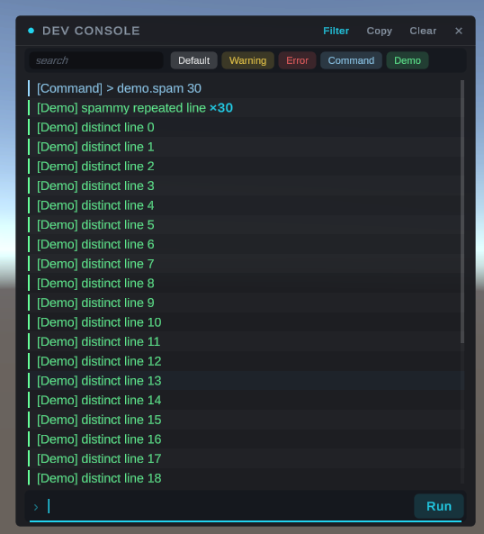

# DevConsole

A drop-in developer console — commands, typed CVars, autocomplete, key bindings, and Unity log capture.
No prefab, no scene setup: the window builds itself in code on first use.

Press **F12** in Play mode.



*Toolbar, search box and per-category filter chips. The `×30` badge is 30 identical lines collapsed
into one row.*

```csharp
using TeekayUtils.DevConsole;

DevConsole.RegisterCommand("give.gold", "Give gold. Usage: give.gold [amount]",
    args => Inventory.AddGold(args.AsInt(0, 100)));

DevConsole.RegisterFloat("player.speed", "Movement speed.",
    () => speed, v => speed = v);

DevConsole.Log("Combat", $"{attacker.name} hit for {damage}");
```

> **Requires TMP Essentials.** `Window ▸ TextMeshPro ▸ Import TMP Essential Resources`, once per project.
> Without them the window refuses to build and logs a warning — commands, CVars and log capture still work.

---

## Access and shipping safety

The console is a cheat surface: it grants free access to every registered command and CVar. It is gated
by `DevConsoleSettings.Access`, and the default keeps it out of release builds.

| `ConsoleAccess` | Openable in |
|---|---|
| `Disabled` | never |
| `EditorOnly` | the editor only |
| `DevBuildsOnly` | editor + development builds (**default**) |
| `Always` | everywhere, including release |

When access is gated off, logging and registration still work — only the openable UI, the toggle key, the
mobile gesture and key bindings are suppressed. `Close()` is never gated: closing always works.

---

## Commands

```csharp
DevConsole.RegisterCommand(name, description, handler);
DevConsole.RegisterCommand(name, description, handler, argCompletions);
DevConsole.Unregister(name);
```

The handler receives `ConsoleArgs`, which never throws — every accessor takes a fallback:

| Member | Notes |
|---|---|
| `int Count` | Number of arguments. |
| `string this[int]` / `Raw(int)` | Raw token, or `null` if out of range. |
| `AsInt(index, fallback = 0)` | Invariant culture. Parse failure returns the fallback. |
| `AsFloat(index, fallback = 0f)` | Invariant culture. |
| `AsBool(index, fallback = false)` | Accepts `0/1`, `true/false`, `on/off`, `yes/no`. |
| `string LastError` | Last parse error, or `null`. Reset on every accessor call. |

Arguments are whitespace-separated; double quotes group multi-word arguments.

`argCompletions[i]` supplies candidate values for argument `i`, which the ghost hint and the suggestion
dropdown will complete after the space:

```csharp
DevConsole.RegisterCommand("ai.debug", "Toggle AI debug. Usage: ai.debug <on|off>",
    args => AI.Debug = args.AsBool(0),
    new[] { new[] { "on", "off" } });
```

Unregister anything you register from a scene object — do it in `OnDestroy`. `Unregister` deliberately
does not resurrect the console during teardown, so it is safe to call from `OnDisable`/`OnDestroy` after
the console object itself has been destroyed.

---

## CVars

A CVar is a named variable the console can read and write, backed by your own getter/setter — no
reflection, no boxing, and it works on locals captured in a closure.

```csharp
DevConsole.RegisterFloat ("player.speed",  "Movement speed.",   () => speed,   v => speed = v);
DevConsole.RegisterInt   ("enemies.max",   "Spawn cap.",        () => max,     v => max = v);
DevConsole.RegisterBool  ("ai.enabled",    "Enable AI.",        () => aiOn,    v => aiOn = v);
DevConsole.RegisterString("player.name",   "Display name.",     () => pName,   v => pName = v);
```

In the console: type the name to print the value, or `name value` to set it.

```
> player.speed
player.speed = 5  (float)
> player.speed 12
player.speed = 12
```

### Play-session-only by default

`Register*` **snapshots** the value at registration and **restores** it on shutdown. Tweaking a CVar to
find a good number does not silently change what your scene ships with.

When you *want* the value to stick across play sessions, use the persistent variants —
`RegisterFloatPersistent`, `RegisterIntPersistent`, `RegisterBoolPersistent`, `RegisterStringPersistent`.

---

## Logging

```csharp
DevConsole.Log("Combat", "Boss enraged");   // categorised
DevConsole.Log("plain message");            // CATEGORY_DEFAULT
DevConsole.RegisterCategory("Combat", new Color(1f, 0.5f, 0.2f));
```

Unity's own `Debug.Log`/`LogWarning`/`LogError`/`LogException` are captured automatically into the
`Default` / `Warning` / `Error` categories.

Logging to a **disabled** category is dropped at the source — a chatty subsystem you have filtered off
costs nothing. Built-in category name constants live on `DevConsoleSettings`: `CATEGORY_DEFAULT`,
`CATEGORY_WARNING`, `CATEGORY_ERROR`, `CATEGORY_COMMAND`.

### The log view

- **Consecutive identical lines collapse** into one row with a `×N` badge — a per-frame logger reads as
  one line with a counter instead of flooding the buffer.
- **Click a line to copy it**; the row flashes to confirm.
- **Auto-scroll only follows when you are already at the bottom.** Scrolled up reading history, new lines
  raise an `N new` pill instead of yanking the viewport.
- **Toolbar**: `Clear`, `Copy` (the filtered log as plain text), `Filter`.
- **Filter row**: a search box, plus one chip per category. Chips drive the same flag as `log_filter` and
  hide existing lines as well as future ones.

---

## Built-in commands

| Command | Usage |
|---|---|
| `help` | `help [name]` — list everything, or describe one entry. |
| `clear` | Clear the log. |
| `quit` | Exit the application. |
| `log_filter` | `log_filter [<category> [on\|off\|toggle]]` |
| `bind` | `bind <KeyName> "<command line>"` — e.g. `bind F3 "player.teleport 0 5 0"` |
| `unbind` | `unbind <KeyName>` |
| `binds` | List all bindings. |

Bindings persist in `PlayerPrefs` and fire even while the console is closed (but not while it is gated
off by `Access`).

---

## Input and focus

**Open** and **focused** are separate states, and gameplay should care about the second one.

Leaving the console open but clicking back into the game gives you a live log monitor while playing.
Pause (`Time.timeScale = 0`) and cursor unlock apply on **focus**, not on open.

```csharp
DevConsole.OnFocusChanged      += focused => playerInput.enabled = !focused;  // gate gameplay input
DevConsole.OnVisibilityChanged += open    => hud.SetVisible(!open);           // panel visibility only
```

### Events

| Event | Fires |
|---|---|
| `OnFocusChanged(bool)` | The input field gains or loses focus. Gate gameplay input on this. |
| `OnVisibilityChanged(bool)` | The console opens or closes. Panel visibility only. |
| `OnLogAppended(ConsoleLogEntry)` | A line was appended — mirror the log elsewhere. |
| `OnLogCleared()` | The log was cleared. |

All four are **static**, and all four are cleared before each play session, so a handler from the
previous session cannot survive into the next one with "Enter Play Mode without domain reload"
enabled. Subscribe in `OnEnable`, unsubscribe in `OnDisable`, as with any long-lived event.

---

## Configuration

Two equivalent routes:

1. Create `Assets/Resources/Configs/DevConsoleConfig.asset`
   (`Create ▸ DevConsole ▸ Config`). The console finds and applies it automatically — zero code.
2. Call `DevConsole.Configure(myConfig)` from your own bootstrap if you would rather not use `Resources`.

Edit it through the config window (the asset's Inspector opens it), or set `DevConsoleSettings`
fields directly in code before the first console call.

### Settings

| Setting | Default | |
|---|---|---|
| `Access` | `DevBuildsOnly` | When the console may open. |
| `ToggleKey` | `F12` | Function keys emit no characters, so they never land in the input field. |
| `PauseOnFocus` | `true` | `Time.timeScale = 0` while focused. |
| `UnlockCursorOnFocus` | `true` | Unlock and restore the cursor. |
| `FontSize` | `14` | Drives all chrome sizing, not just text. |
| `FontAsset` | `null` | Assign a **monospace** TMP font to make `help`/`binds` columns line up. |
| `MaxLogEntries` | `500` | Ring buffer cap. |
| `MaxHistoryEntries` | `50` | Up/down recall depth. |

**Mobile** — open by tapping a screen corner repeatedly: `MobileTapCorner` (`TopLeft`, `None` disables),
`MobileTapCount` (`5`), `MobileTapTimeout` (`1.5`), `MobileTapCornerSize` (`0.2` of the shorter side).
The hot-zone is invisible, so players will not find it by accident.

### Theme

Chrome and content colours share one surface. Hover and selection tints are **derived** from
`AccentColor`, so a retint is usually one field.

| | Default | |
|---|---|---|
| `AccentColor` | `#22D3EE` | Caret, focus ring, selection, active toggles. |
| `ErrorAccentColor` | `#F56B73` | Failed-command flash, close-button hover. |
| `ChromeWindowColor` | `#0E1014` | Window background (slightly translucent). |
| `ChromeElevatedColor` | `#16191F` | Input card, dropdown, filter row. |
| `ChromeHoverColor` | `#1E232A` | Row hover. |
| `ChromeTextPrimary` / `Muted` / `Subtle` | | Three text tiers. |
| `DefaultLogColor` / `WarningLogColor` / `ErrorLogColor` / `CommandEchoColor` / `HintColor` | | Log content. |

The package ships **no font asset** — `FontAsset` stays null and falls back to TMP's default.

---

## Autocomplete and history

- **Type** — the inline ghost hint shows the completion; the dropdown ranks matches (prefix above
  substring, then alphabetical).
- **Tab** — accept the highlighted suggestion, or the ghost hint if none is highlighted.
- **Up / Down** — navigate the dropdown when it has matches; otherwise walk command history.
- **Enter** — always executes, never "accepts a suggestion".

History is bash-style: consecutive duplicates are not recorded, and stepping past the newest entry
returns you to the live line.

---

## Window

Drag the title bar to move; drag any edge or corner to resize. Position and size persist in `PlayerPrefs`
across sessions.
